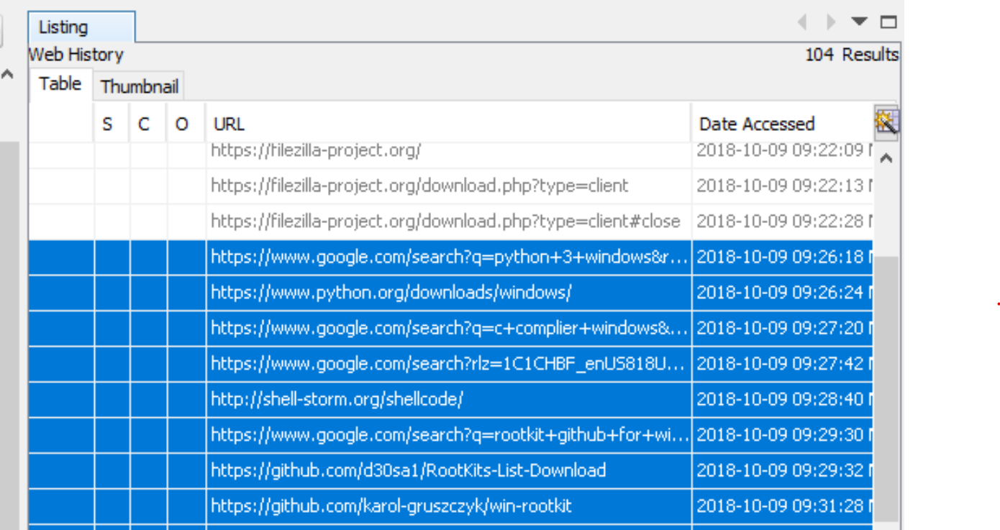
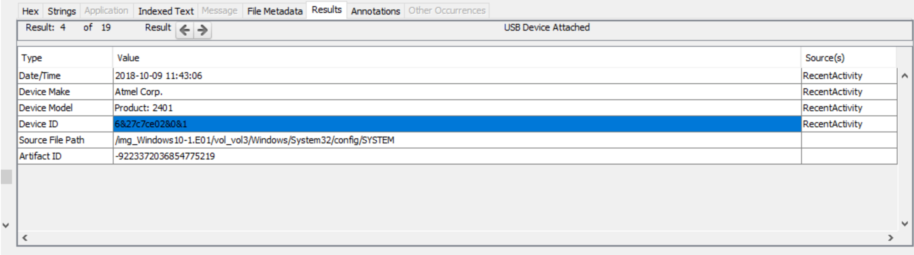
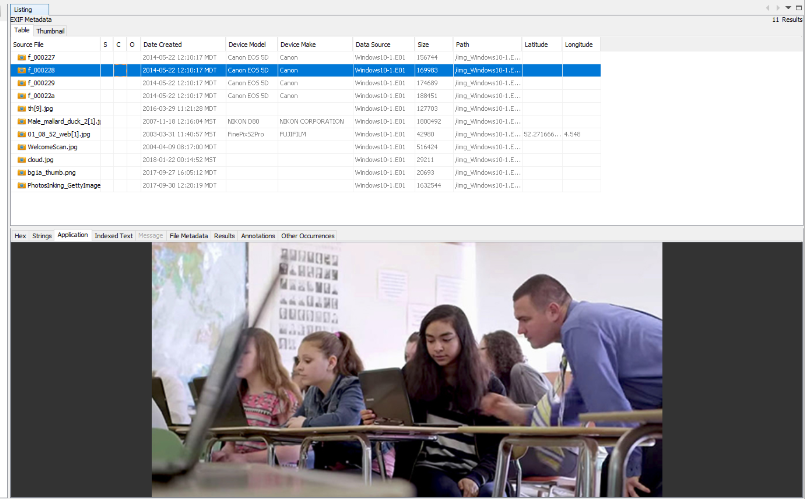
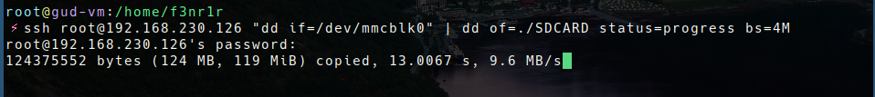
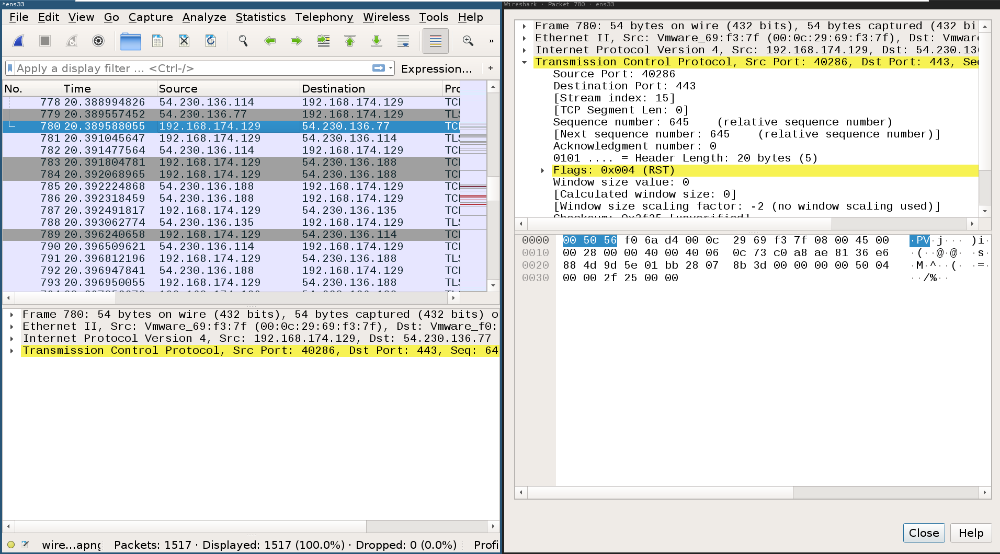
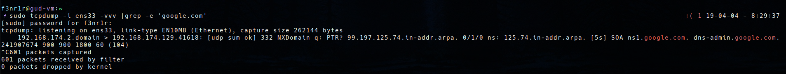
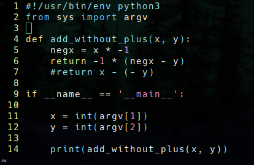

# Personal Forensics Toolkit

## Introduction

This document should be used as a Digital Forensics Toolkit quick reference sheet. Each tool includes the following:

- Source URL (each tool's title is hyperlinked)
- Description
- Review
- Usage
- Installation

**Unless otherwise stated, all tools are installed on Debian GNU/Linux*

## Installation
**If you do not want to install all of the packages, installation instructions come with each individual tool.*

To install all of the tools listed in my toolkit on Debian GNU/Linux based distribution simply run the install script as follows:

```bash
chmod +x install.sh
sudo ./install.sh
```

If there are any  packages you want add or remove from your install, you can add/remove them in:

```bash 
forensics_pkgs.txt 
```
**make sure each package has its own line*

<!--ts-->
   * [Personal Forensics Toolkit](#personal-forensics-toolkit)
      * [Installation](#installation)
      * [1. Host and Storage Tools](#1-host-and-storage-tools)
         * [<a href="https://accessdata.com/product-download/ftk-imager-version-4.2.0" rel="nofollow">1.1 FTK Imager</a>](#11-ftk-imager)
         * [<a href="https://www.sleuthkit.org/autopsy/" rel="nofollow">1.2 Autopsy</a>](#12-autopsy)
         * [<a href="https://linux.die.net/man/1/dd" rel="nofollow">1.3 dd</a>](#13-dd)
      * [2. Network Tools](#2-network-tools)
         * [<a href="http://www.wireshark.org/" rel="nofollow">2.1 Wireshark</a>](#21-wireshark)
         * [<a href="https://www.zeek.org/" rel="nofollow">2.2 Zeek AKA Bro</a>](#22-zeek-aka-bro)
         * [<a href="http://www.tcpdump.org/" rel="nofollow">2.3 tcpdump</a>](#23-tcpdump)
         * [<a href="http://snort.org" rel="nofollow">2.4 Snort</a>](#24-snort)
      * [3. Memory Analysis Tools](#3-memory-analysis-tools)
         * [<a href="https://www.volatilityfoundation.org/" rel="nofollow">3.1 Volatility</a>](#31-volatility)
         * [<a href="https://github.com/504ensicsLabs/LiME">3.2 LiME</a>](#32-lime)
      * [4. Documentation and Other Tools](#4-documentation-and-other-tools)
         * [<a href="https://github.com/jessek/hashdeep">4.1 hashdeep</a>](#41-hashdeep)
         * [<a href="https://github.com/vim/vim">4.2 vim</a>](#42-vim)

<!--te-->

## 1. Host and Storage Tools
### [1.1 FTK Imager](https://accessdata.com/product-download/ftk-imager-version-4.2.0)

- FTK Imager is a commercial forensic imaging software distributed by AccessData. The program creates images from hard drives and other types of storage devices. FTK can create images in four different file formats: .E01, SMART, AFF, and Raw. These images can be one file or be split into segments that can be constructed later on. When the file is split into segments, the files can be moved and stored in several locations.

  **[Source](https://www.champlain.edu/Documents/LCDI/Tool_Comparison_(1).pdf)*
- Review

  - I really like using FTK Imager, it is very easy to use and runs well off a USB drive. For faster speeds, I recommend running it on a USB flash drive rather than an external hard disk,

- Usage

  - FTK Imager comes with a GUI that is very straight forward and easy-to-use. Simply choose what you want to name your disk images and follow the prompts. 

   - CLI: 
  ```bash
  ftkimager <source drive> <destination> --case-number <X> --evidence-number <X> --examiner <X> --outpass <encryption password>
  ```
  
### [1.2 Autopsy](<https://www.sleuthkit.org/autopsy/>)

- Description

  - Autopsy® is a digital forensics platform and graphical interface to The Sleuth Kit® and other digital forensics tools. It is used by law enforcement, military, and corporate examiners to investigate what happened on a computer. You can even use it to recover photos from your camera’s memory card.
    *[Source](https://www.sleuthkit.org/autopsy)*

- Review

  - I prefer almost every tool in a Linux environment, apart from Autopsy. The user interface in Linux Autopsy is nigh impossible to use. Do yourself a favor and just use the Windows 10 Version, it really is better. 

- Usage

  - Simply use the GUI to navigate to various sections of the disk. I like to go in this order:

    1. If you an idea of what you are looking for, initialize a keyword search. (I like to do this first, it can take some time).

    2. Check the security logs. 

       1. On Linux, check at

          ```/var/log/auth and /var/log/secure```

       2. On Windows 10, check the Window's Defender Logs at  

          ```/ProgramData/Microsoft/Windows Defender/Scans/History```

    3. Check user temp files

       - On Linux, check at 

         ``\temp``

       - On Windows 10, check 

         ```Users/username/AppData/Local/Temp```

    4. Check Registry 

    5. Check Web Search, History, and Artifacts

       

    6. Check emails

    7. Check Peripheral and Aux Devices for USB Rubby Duckys and similar devices

       

    8. Check Multimedia Files

       

  **can be install via apt on Debian-based Linux distributions*

  ```bash
  sudo apt install autopsy
  ```

### [1.3 dd](https://linux.die.net/man/1/dd)

- Description

  - Convert and copy a file, write disk headers, boot records, create a boot floppy. dd can make an exact clone of an (unmounted) disk, this will include all blank space so the output destination must be at least as large as the input.

    **[Source](<https://ss64.com/bash/dd.html>)*

- Review

  - I use dd all the time. Once you've used it a couple times it very easy to use. All you need to know is that disks are considered files and your "if" is the source disk, and the "of" is where you want the the disk file to go. Additionally, using the "status" lets you know the progress of the copy. I like setting my read/write block size to 4 megabytes.

- Usage


  ```bash
  sudo dd if=/dev/sdX of=<destination> bs=4M status=progress
  ```
Things start to get really spicy when you use dd over SSH. I like to do this to clone my Raspberry Pis.
  ```bash
  ssh root@<remote ip> "dd if=/<source disk>" | dd of=<destination file> status=progress bs=4M
  ```



  ** dd comes default on all Debian-based Linux distributions*


## 2. Network Tools

### [2.1 Wireshark](http://www.wireshark.org/)

- Description

  - **Wireshark** is a GUI network protocol analyzer. It lets you interactively browse packet data from a live network or from a previously saved capture file. **Wireshark**'s native capture file format is **pcap** format, which is also the format used by **tcpdump** and various other tools.
  - **[Source](<https://www.wireshark.org/docs/man-pages/wireshark.html>)*

- Review

  - I am not a huge fan of Wireshark. Wireshark is *very* memory consumptive, also I have found that most of the time Wireshark gives way too much information. With that said, Wireshark is extremely useful when you want to really dig into some network data.

- Usage

  To pull up the GUI and perform a live packet capture:


  ```bash
  sudo wireshark
  ```
  - Then choose the interface you want to sniff on.

  

  To use the GUI to browser through an existing pcap file:

  ```bash
  sudo wireshark <name of pcap>
  ```
  **can be install via apt on Debian-based Linux distributions*

  ```bash
  sudo apt install wireshark
  ```

### [2.2 Zeek AKA Bro](https://www.zeek.org/)

- Description

  - Bro is primarily a security monitor that inspects all traffic on a link in depth for signs of suspicious activity. More generally, however, Bro supports a wide range of traffic analysis tasks even outside of the security domain,  including performance measurements and helping with trouble-shooting.
  - Bro comes with built-in functionality for a range of analysis and detection tasks, including detecting malware by interfacing to external registries, reporting vulnerable versions of software seen on the network, identifying popular web applications, detecting SSHbrute-forcing, validating SSL certificate chains, among others.
    **[Source](http://manpages.ubuntu.com/manpages/xenial/man8/bro.8.html)*

- Review

  - Zeek, previously known as Bro, is my absolute favorite network monitoring tool. Bro has its own scripting language that you can use to tune your network sniffing to an extreme. Bro is great because it gives you a high-level view of what is going on in your network, whereas Wireshark gives you everything, down to the version of each network protocol of each packet(Bro is capable of this as well). 
  - I typically use Bro as a live network monitoring appliance, but in terms of Digital Forensics, Bro works better at parsing through pcaps and creates logs based on the traffic within the pcap.

- Usage

  ```bash
  sudo bro -r -C capture.pcap
  ```
  **can be install via apt on Debian-based Linux distributions*
  ```bash
  sudo apt install bro broctl
  ```

### [2.3 tcpdump](http://www.tcpdump.org/)

- Description

  - Dumps traffic on a network. Tcpdump  prints  out a description of the contents of packets on a network interface that match the boolean expression.

    *[Source](https://www.tcpdump.org/manpages/tcpdump.1.html)*

- Review

  - tcpdump is my go to tool when I want to know what is going on in my network RIGHT NOW. tcpdump can be used in the same way as Bro and Wireshark to parse through pcaps, but I have found that I prefer Bro for that task.

- Usage

  ```bash
  tcpdump -i <interface> -vvv |grep -e '<regex pattern>'
  ```

  

  **can be install via apt on Debian-based Linux distributions*   
    ```bash
  sudo apt install tcpdump
    ```

  
### [2.4 Snort](http://snort.org)

- Description

  - Snort is an open source network intrusion detection system,  capable  of  performing real-time traffic analysis and packet logging on IP networks.  It can perform protocol analysis, content searching/matching and can be used  to  detect  a  variety  of attacks  and  probes, such as buffer overflows, stealth port scans, CGI attacks, SMB probes, OS fingerprinting attempts, and much more.  Snort uses a flexible rules language  to  describe  traffic  that it should collect or pass, as well as a detection engine that utilizes a modular plugin architecture.  Snort also has a modular  real-time  alerting  capability, incorporating alerting and logging plugins for syslog, a ASCII text files, UNIX sockets or XML.

  - Snort has three primary uses.  It can be used as a straight packet sniffer like tcpdump(1),  a  packet logger (useful for network traffic debugging, etc), or as a full blown network intrusion detection system.
    **[Source](<https://www.manpagez.com/man/8/snort/>)*

- Review

  - I like snort a lot. Not as much as Bro, but it's still pretty dang good. I like Snort because it is a intrusion detection system, Snort looks at network traffic specifically for attacks and network-based malware. The community around snort has contributed many custom Snort rules that can be saved at ```/etc/snort/rules/``` .

- Usage

  ```bash
  sudo snort -r <pcap file> -c <config file location>
  ```
  - After that, snort will print its results to ```/var/log/snort/alert``` .

  **can be install via apt on Debian-based Linux distributions*

  ```bash
  sudo apt install snort
  ```

  
## 3. Memory Analysis Tools

### [3.1 Volatility](https://www.volatilityfoundation.org/)

- Description

  - The Volatility Framework is a completely open collection of tools forthe extraction of digital artifacts from volatile memory (RAM) samples. It is useful in forensics analysis. The extraction techniques are performed completely independent of the system being investigated but offer unprecedented visibility into the runtime state of the system.

    **[Source](http://manpages.ubuntu.com/manpages/cosmic/en/man1/volatility.1.html)*

- Review

  - Volatility is an extremely useful tool for analyzing memory captures. Volatility allows you really dig into what's going on in the memory. You can view all the processes in memory, network connections, and even find identify malware itself!
  - Below are some useful commands to run with Volatility.

- Usage

  ```bash
  volatility -f <memory capture>.mem <flag>
  ```
  - These are the flags that I have found to be most useful. They are sequenced in the order I would use them.

  ```bash 
   imageinfo, malfind, netscan, sockscan, pslist, psscan, psttree, psxview, apihooks
  ```

  **can be install via apt on Debian-based Linux distributions*

  ```bash
  sudo apt install volatility
  ```

  
### [3.2 LiME](https://github.com/504ensicsLabs/LiME)

- Description

  - A Loadable Kernel Module (LKM) which allows for volatile memory acquisition from Linux and Linux-based devices, such as Android. This makes LiME unique as it is the first tool that allows for full memory captures on Android devices. It also minimizes its interaction between user and kernel space processes during acquisition, which allows it to produce memory captures that are more forensically sound than those of other tools designed for Linux memory acquisition.
  **[Source](https://github.com/504ensicsLabs/LiME/blob/master/README.md)*

- Review

  - When I first used LiME. I was very confused. I didn't understand why I was inserting a kernel module to capture memory. However, LiME proved to be very useful and easy to use once I was able to figure out how to pipe out the memory capture through ssh injection. 

- Usage
  1. Install LiMe via apt
  ```bash
  sudo apt install lime-forensics-dkms 
  ```
  2. Acquire memory via ssh
```bash
	ssh root@<remote ip> 'insmod /root/lime.ko "path=/root/memcap format=lime timeout=0'| > ./memory-capture.memcap
```
**can be install via apt on Debian-based Linux distributions*

  ```bash
 	 sudo apt install lime-forensics-dkms
  ```


## 4. Documentation and Other Tools

### [4.1 hashdeep](https://github.com/jessek/hashdeep)

- Description

  -  Computes multiple hashes, or message digests, for any number of files while  optionally  recursively  digging  through the directory structure.  By default the program computes MD5 and SHA-256 hashes, equivalent to -c md5,sha256.  Can also take a  list of  known  hashes and display the filenames of input files whose hashes either do or do not match any of the known hashes.  Can also use a list of known hashes to  audit a  set  of FILES.  Errors are reported to standard error. If no FILES are specified, reads from standard input.
  **[Source](https://linux.die.net/man/1/hashdeep)*

- Review

  - This application is the best. When I am given a directory of files that all need to be hashed, this is by far the easiest tool to use, hashdeep recursively traverses a directory and computes hashes of all the files in the directory!  It's super useful. This app gets A+ and  👍👍

- Usage to produce MD5 sums:

  ```bash
  md5deep -r <directory> > md5sums.chk  
  ```
- Usage to produce sha256 sums:

  ```bash
  sha256deep -r <directory> > sha256sums.chk  
  ```
  **can be install via apt on Debian-based Linux distributions*
  ```bash
  sudo apt install hashdeep 
  ```

  

### [4.2 vim](https://github.com/vim/vim)

- Description

  - Vim is a text editor that is upwards compatible to Vi. It can be used to edit all kinds of plain text. It is especially useful for editing programs. 
  **[Source](https://linux.die.net/man/1/vim)*

- Review

  - Vim is by absolute favorite text editor, so much so that I don't use any kind of IDE. As many other terminal-based text editors, Vim can have a steep learning curve; however, with that said, learning to use Vim is an extremely useful skill that makes command-line/terminal based programming and configuration 1000x more efficient. 

  - The biggest draw of Vim  for  most people is that it is highly customizable, programmable, resource-light, and can open any type of file for editing. 

  - Here's what Vim looks like with Python3 syntax highlighting, Dracula colorscheme, and numbering set:

    

    

- Usage

  ```bash
  vim <filename>
  ```
  **can be install via apt on Debian-based Linux distributions*
  ```bash
  sudo apt install vim
  ```


<!---

	### []()
	
	- Description

  


  	**Source]()*

	- Review

 	 - 

- Usage

 	 ```bash

 	 ```

	  **can be install via apt on Debian-based Linux distributions*
	
	  ```bash
	  
	  ```
--->
